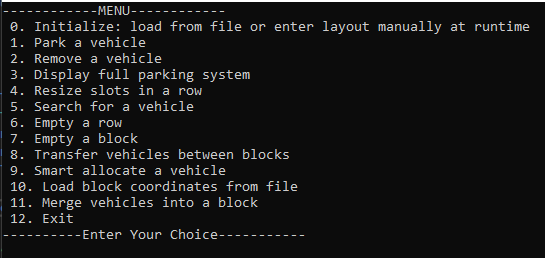

# Smart-Parking-System
# Smart Parking System (C++)

A dynamic Smart Parking System implemented in **C++** using **Object-Oriented Programming and Dynamic Memory Management**.

The system manages parking blocks, rows, and slots dynamically and provides intelligent slot allocation based on distance.

---

## Features

- Dynamic parking structure using **jagged arrays**
- Initialize parking layout **manually or from file**
- Park vehicles in specific slots
- Remove parked vehicles
- Display complete parking system
- Resize parking slots dynamically
- Search for vehicles
- Empty a row or an entire block
- Transfer vehicles between blocks
- Merge vehicles from one block into another
- Smart slot allocation based on **minimum distance**
- Load block coordinates from file

---

## Smart Allocation Logic

Each block has coordinates `(x, y)` on a 2D plane.

Slot positions are calculated using offsets:

- **Slot width:** 8 feet
- **Row depth:** 16 feet

Distance between slots is calculated using Euclidean distance.

```
distance = √((x2 - x1)² + (y2 - y1)²)
```

The system automatically parks the vehicle in the **nearest available slot**.

---

## Project Structure

```
Smart-Parking-System
│
├── parking_system.cpp
├── blocks.txt
├── coordinates.txt
├── README.md
└── screenshots
     └── menu.png
```

---

## Program Menu



---


## Concepts Demonstrated

- Object-Oriented Programming
- Dynamic Memory Allocation
- Copy Constructor
- Move Constructor
- Copy Assignment Operator
- Move Assignment Operator
- Jagged Arrays
- File Handling
- Euclidean Distance Algorithm

---

## Author

**Zara Aziz**

Computer Science Student interested in **systems, algorithms, and software development**.
